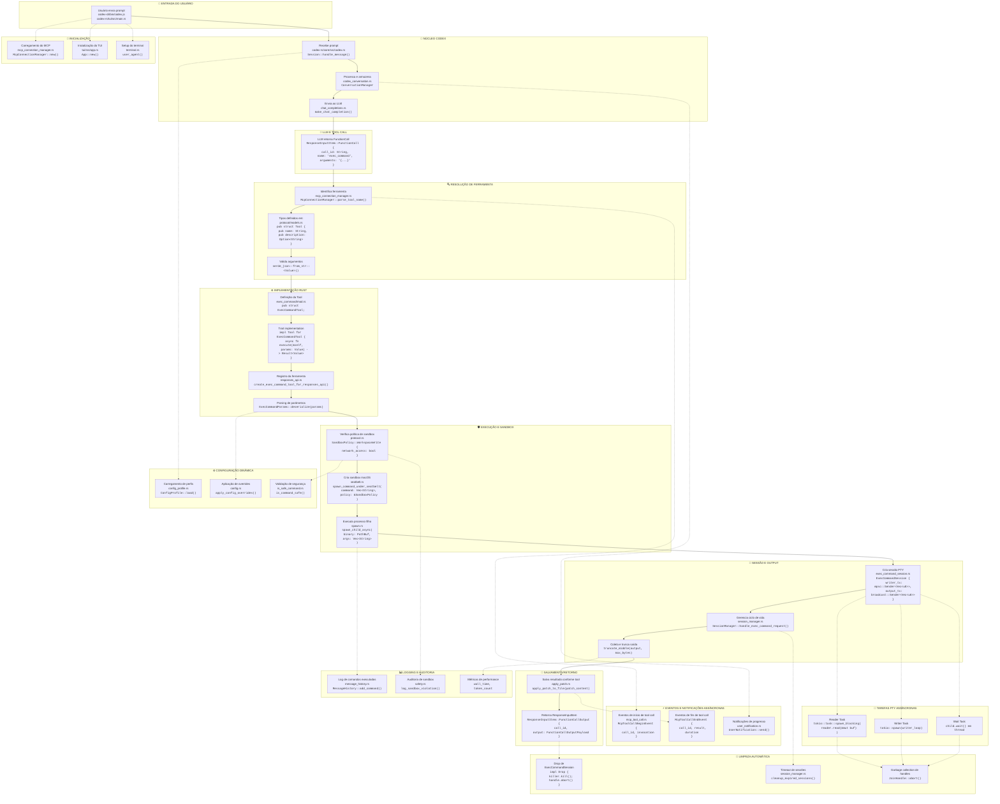

# Fluxo Detalhado: Implementação de Ferramenta no Codex

## Fluxograma Principal - Como as Ferramentas São Implementadas no Rust


```mermaid
flowchart TD
    subgraph Entrada["🎯 ENTRADA DO USUÁRIO"]
        A1["Usuário envia prompt<br/>codex-cli/bin/codex.js<br/>codex-rs/tui/src/main.rs"]
    end

    subgraph Core["🔧 NÚCLEO CODEX"]
        B1["Recebe prompt<br/>codex-rs/core/src/codex.rs<br/><code>Session::handle_message()</code>"]
        B2["Processa e armazena<br/>codex_conversation.rs<br/><code>ConversationManager</code>"]
        B3["Envia ao LLM<br/>chat_completions.rs<br/><code>make_chat_completion()</code>"]
    end

    subgraph LLM["🤖 LLM E TOOL CALL"]
        C1["LLM retorna FunctionCall<br/><code>ResponseInputItem::FunctionCall {<br/>  call_id: String,<br/>  name: 'exec_command',<br/>  arguments: '{...}'<br/>}</code>"]
    end

    subgraph Resolution["🔍 RESOLUÇÃO DE FERRAMENTA"]
        D1["Identifica ferramenta<br/>mcp_connection_manager.rs<br/><code>McpConnectionManager::parse_tool_name()</code>"]
        D2["Tipos definidos em:<br/>protocol/models.rs<br/><code>pub struct Tool {<br/>  pub name: String,<br/>  pub description: Option&lt;String&gt;<br/>}</code>"]
        D3["Valida argumentos<br/><code>serde_json::from_str::&lt;Value&gt;()</code>"]
    end

    subgraph Implementation["⚙️ IMPLEMENTAÇÃO RUST"]
        E1["Definição da Tool<br/>exec_command/mod.rs<br/><code>pub struct ExecCommandTool;</code>"]
        E2["Trait implementation<br/><code>impl Tool for ExecCommandTool {<br/>  async fn execute(&self,<br/>    params: Value) -&gt; Result&lt;Value&gt;<br/>}</code>"]
        E3["Registro da ferramenta<br/>responses_api.rs<br/><code>create_exec_command_tool_for_responses_api()</code>"]
        E4["Parsing de parâmetros<br/><code>ExecCommandParams::deserialize(params)</code>"]
    end

    subgraph Sandbox["🛡️ EXECUÇÃO E SANDBOX"]
        F1["Verifica política de sandbox<br/>protocol.rs<br/><code>SandboxPolicy::WorkspaceWrite {<br/>  network_access: bool<br/>}</code>"]
        F2["Cria sandbox macOS<br/>seatbelt.rs<br/><code>spawn_command_under_seatbelt(<br/>  command: Vec&lt;String&gt;,<br/>  policy: &SandboxPolicy<br/>)</code>"]
        F3["Executa processo filho<br/>spawn.rs<br/><code>spawn_child_async(<br/>  binary: PathBuf,<br/>  args: Vec&lt;String&gt;<br/>)</code>"]
    end

    subgraph Session["📡 SESSÃO E OUTPUT"]
        G1["Cria sessão PTY<br/>exec_command_session.rs<br/><code>ExecCommandSession {<br/>  writer_tx: mpsc::Sender&lt;Vec&lt;u8&gt;&gt;,<br/>  output_tx: broadcast::Sender&lt;Vec&lt;u8&gt;&gt;<br/>}</code>"]
        G2["Gerencia ciclo de vida<br/>session_manager.rs<br/><code>SessionManager::handle_exec_command_request()</code>"]
        G3["Coleta e trunca saída<br/><code>truncate_middle(output, max_bytes)</code>"]
    end

    subgraph Output["💾 SALVAMENTO/RETORNO"]
        H1["Salva resultado conforme tool<br/>apply_patch.rs<br/><code>apply_patch_to_file(patch_content)</code>"]
        H2["Retorna ResponseInputItem<br/><code>ResponseInputItem::FunctionCallOutput {<br/>  call_id,<br/>  output: FunctionCallOutputPayload<br/>}</code>"]
    end

    %% Ações e Objetos Paralelos
    subgraph Eventos["⚡ EVENTOS E NOTIFICAÇÕES ASSÍNCRONAS"]
        J1["Eventos de início de tool call<br/>mcp_tool_call.rs<br/><code>McpToolCallBeginEvent {<br/>  call_id, invocation<br/>}</code>"]
        J2["Eventos de fim de tool call<br/><code>McpToolCallEndEvent {<br/>  call_id, result, duration<br/>}</code>"]
        J3["Notificações de progresso<br/>user_notification.rs<br/><code>UserNotification::send()</code>"]
    end

    subgraph Logs["📊 LOGGING E AUDITORIA"]
        K1["Log de comandos executados<br/>message_history.rs<br/><code>MessageHistory::add_command()</code>"]
        K2["Auditoria de sandbox<br/>safety.rs<br/><code>log_sandbox_violation()</code>"]
        K3["Métricas de performance<br/><code>wall_time, token_count</code>"]
    end

    subgraph Config["⚙️ CONFIGURAÇÃO DINÂMICA"]
        L1["Carregamento de perfis<br/>config_profile.rs<br/><code>ConfigProfile::load()</code>"]
        L2["Aplicação de overrides<br/>config.rs<br/><code>apply_config_overrides()</code>"]
        L3["Validação de segurança<br/>is_safe_command.rs<br/><code>is_command_safe()</code>"]
    end

    subgraph PTYTasks["🔧 TAREFAS PTY ASSÍNCRONAS"]
        M1["Reader Task<br/><code>tokio::task::spawn_blocking(<br/>  reader.read(&mut buf)<br/>)</code>"]
        M2["Writer Task<br/><code>tokio::spawn(writer_loop)</code>"]
        M3["Wait Task<br/><code>child.wait() em thread</code>"]
    end

    subgraph Cleanup["🧹 LIMPEZA AUTOMÁTICA"]
        N1["Drop de ExecCommandSession<br/><code>impl Drop {<br/>  killer.kill();<br/>  handle.abort()<br/>}</code>"]
        N2["Timeout de sessões<br/>session_manager.rs<br/><code>cleanup_expired_sessions()</code>"]
        N3["Garbage collection de handles<br/><code>JoinHandle::abort()</code>"]
    end

    %% Fluxo principal
    A1 --> B1
    B1 --> B2
    B2 --> B3
    B3 --> C1
    C1 --> D1
    D1 --> D2
    D2 --> D3
    D3 --> E1
    E1 --> E2
    E2 --> E3
    E3 --> E4
    E4 --> F1
    F1 --> F2
    F2 --> F3
    F3 --> G1
    G1 --> G2
    G2 --> G3
    G3 --> H1
    H1 --> H2

    %% Ações paralelas e assíncronas
    D1 -.-> J1
    H1 -.-> J2
    B2 -.-> J3
    
    F3 -.-> K1
    F1 -.-> K2
    G3 -.-> K3
    
    B1 -.-> L1
    E4 -.-> L2
    F1 -.-> L3
    
    G1 -.-> M1
    G1 -.-> M2
    G1 -.-> M3
    
    H2 -.-> N1
    G2 -.-> N2
    M1 -.-> N3
    M2 -.-> N3
    M3 -.-> N3

    %% Eventos de inicialização e configuração
    subgraph Init["🚀 INICIALIZAÇÃO"]
        I1["Carregamento do MCP<br/>mcp_connection_manager.rs<br/><code>McpConnectionManager::new()</code>"]
        I2["Inicialização do TUI<br/>tui/src/app.rs<br/><code>App::new()</code>"]
        I3["Setup do terminal<br/>terminal.rs<br/><code>user_agent()</code>"]
    end

    A1 -.-> I1
    A1 -.-> I2
    A1 -.-> I3
```

---

## Ações de Objetos e Fluxos Paralelos

### 1. Eventos Assíncronos
```rust
// Disparo de eventos durante execução de ferramenta
async fn notify_mcp_tool_call_event(sess: &Session, sub_id: &str, event: EventMsg) {
    sess.send_event(Event {
        id: sub_id.to_string(),
        msg: event,
    }).await;
}

// Eventos disparados automaticamente:
// - McpToolCallBeginEvent quando ferramenta inicia
// - McpToolCallEndEvent quando ferramenta termina
// - Progress events durante execução longa
```

### 2. Logging e Auditoria Paralelos
```rust
// Logs automáticos durante execução
impl MessageHistory {
    pub fn add_command(&mut self, command: &str, result: &ExecResult) {
        self.commands.push(CommandLogEntry {
            timestamp: Utc::now(),
            command: command.to_string(),
            exit_status: result.exit_status,
            wall_time: result.wall_time,
        });
    }
}

// Auditoria de sandbox (executada em paralelo)
pub fn log_sandbox_violation(command: &str, policy: &SandboxPolicy) {
    warn!("Sandbox violation attempt: {} with policy {:?}", command, policy);
}
```

### 3. Configuração Dinâmica
```rust
// Carregamento de configuração durante runtime
impl ConfigProfile {
    pub fn load() -> Self {
        // Carrega perfis de configuração dinamicamente
        // Aplicado antes da execução de cada ferramenta
    }
}

// Validação de segurança (executada para cada comando)
pub fn is_command_safe(command: &str, policy: &SandboxPolicy) -> bool {
    // Verifica lista de comandos bloqueados
    // Aplicada antes da criação do sandbox
}
```

### 4. Tarefas PTY Assíncronas
```rust
// Reader task (executa em paralelo com a ferramenta)
let reader_handle = tokio::task::spawn_blocking(move || {
    let mut buf = [0u8; 8192];
    loop {
        match reader.read(&mut buf) {
            Ok(0) => break, // EOF
            Ok(n) => {
                // Forward para broadcast channel
                let _ = output_tx_clone.send(buf[..n].to_vec());
            }
            Err(_) => break,
        }
    }
});

// Writer task (aceita input assíncrono)
let writer_handle = tokio::spawn(async move {
    while let Some(bytes) = writer_rx.recv().await {
        // Escreve no PTY master
        let _ = writer.write_all(&bytes);
    }
});

// Wait task (monitora saída do processo)
let wait_handle = tokio::task::spawn_blocking(move || {
    let code = match child.wait() {
        Ok(status) => status.exit_code() as i32,
        Err(_) => -1,
    };
    let _ = exit_tx.send(code);
});
```

### 5. Limpeza Automática
```rust
// Drop automático de recursos
impl Drop for ExecCommandSession {
    fn drop(&mut self) {
        // Mata processo primeiro
        if let Ok(mut killer_opt) = self.killer.lock() {
            if let Some(mut killer) = killer_opt.take() {
                let _ = killer.kill();
            }
        }
        
        // Aborta todas as tasks assíncronas
        self.reader_handle.abort();
        self.writer_handle.abort(); 
        self.wait_handle.abort();
    }
}

// Limpeza periódica de sessões expiradas
impl SessionManager {
    async fn cleanup_expired_sessions(&self) {
        let mut sessions = self.sessions.lock().await;
        sessions.retain(|_, session| !session.is_expired());
    }
}
```

### 6. Inicialização de Componentes
```rust
// Inicialização do MCP (executada na startup)
impl McpConnectionManager {
    pub async fn new(mcp_servers: HashMap<String, McpServerConfig>) -> Result<Self> {
        // Spawna todos os servidores MCP em paralelo
        let mut join_set = JoinSet::new();
        for (server_name, cfg) in mcp_servers {
            join_set.spawn(async move {
                McpClient::new_stdio_client(cfg.command, cfg.args, cfg.env).await
            });
        }
        // Aguarda inicialização de todos os servidores
    }
}

// Setup do terminal (detecta tipo de terminal)
pub fn user_agent() -> String {
    // Detecta terminal via variáveis de ambiente
    // Usado para telemetria e otimizações específicas
}
```

### 7. Objetos de Estado Compartilhado
```rust
// Estado global do core
pub struct Session {
    conversation_manager: Arc<Mutex<ConversationManager>>,
    mcp_manager: Arc<McpConnectionManager>,
    exec_session_manager: Arc<ExecSessionManager>,
    // Compartilhado entre todas as operações
}

// Estado da aplicação TUI
pub struct App {
    chat_widget: ChatWidget,
    input_widget: InputWidget,
    status: AppStatus,
    // Atualizado assincronamente via eventos
}
```

---

Este documento agora inclui todas as ações de objetos, fluxos paralelos e assíncronos que ocorrem durante a execução de uma ferramenta no Codex, mostrando como os componentes interagem em paralelo com o fluxo principal de execução.